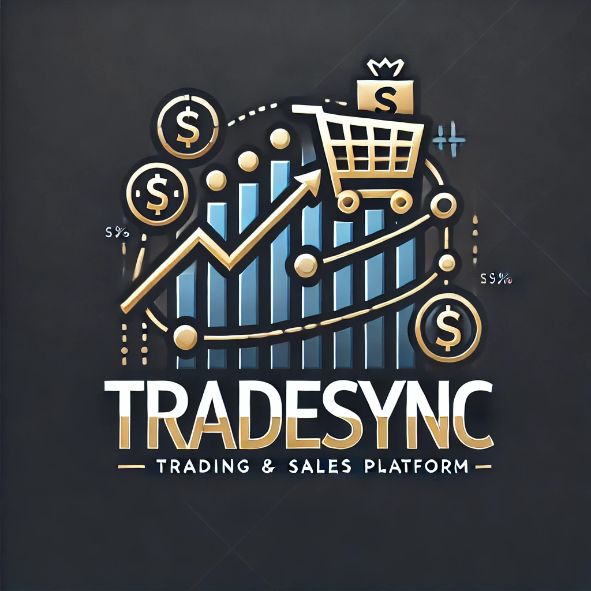

# Sales and Trading App 🚀

Link to video with functional - [mkv](https://kbtuedu-my.sharepoint.com/:v:/g/personal/a_zhumabayev_kbtu_kz/EaCxLMF8CgNDr8DFjmD0dXQBusKxAhN1pbBR4uYavTR9rg?nav=eyJyZWZlcnJhbEluZm8iOnsicmVmZXJyYWxBcHAiOiJPbmVEcml2ZUZvckJ1c2luZXNzIiwicmVmZXJyYWxBcHBQbGF0Zm9ybSI6IldlYiIsInJlZmVycmFsTW9kZSI6InZpZXciLCJyZWZlcnJhbFZpZXciOiJNeUZpbGVzTGlua0NvcHkifX0&e=5Y5IFS)

A web-based platform for financial asset trading, sales tracking, and analytics.

## Tech Stack

- **Backend**: Django (DRF)
- **Database**: PostgreSQL
- **Async Tasks**: Celery + Redis
- **Caching & Queue**: Redis
- **API Docs**: DRF-Spectacular
- **Deployment**: Docker + Nginx (Load Balancer)
- **Monitoring**: Prometheus + Grafana
- **Security**: JWT Authentication, Role-based Access Control
